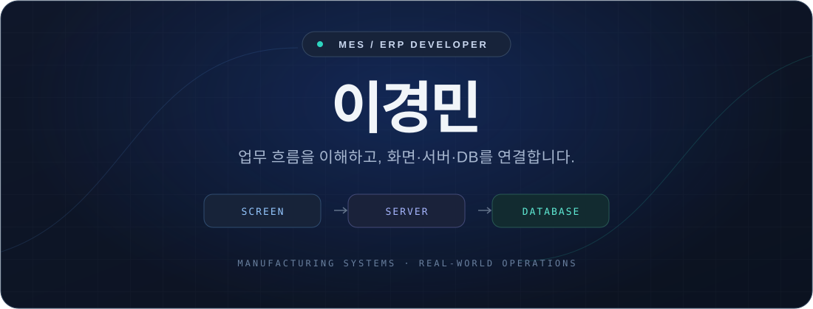

  

 

<h3 align="center">현장의 업무를, 실제로 쓰이는 기능으로.</h3>

여러 제조업체의 <b>MES·ERP 구축과 고도화</b>에 참여하며 
현업의 요구를 화면·서버·DB로 구현해 왔습니다. 
기능 개발부터 데이터 검증, 사용자 교육과 시스템 오픈까지 함께합니다.

  
   
  프로젝트별 담당 업무 · 기술 경험 · PDF 다운로드

 

<h3 align="center">What I Work On</h3>

  <b>01 &nbsp; 업무 시스템 개발</b> 
  영업·구매·외주·무역·생산·품질·재고 기능 개발과 개선  
  <b>02 &nbsp; 데이터 연계와 검증</b> 
  외부 API 연동 · 전표 간 데이터 연계 · 조회 쿼리 개선  
  <b>03 &nbsp; 현장 업무 지원</b> 
  바코드·PDA 화면 · 자동검사기 파일 수집 · 사용자 교육

 

<h3 align="center">Tools of My Trade</h3>

  

  
  
  
  

  <b>Backend</b> &nbsp; Java · Spring Framework · MyBatis &nbsp; / &nbsp; MSSQL 
  <b>Frontend</b> &nbsp; JavaScript · jQuery · JSP · HTML · CSS 
  <b>Version Control</b> &nbsp; Git · SVN

 

  업무와 기술을 꾸준히 익히며, 사용자와 동료가 믿고 맡길 수 있는 개발자로 성장하고 있습니다.

